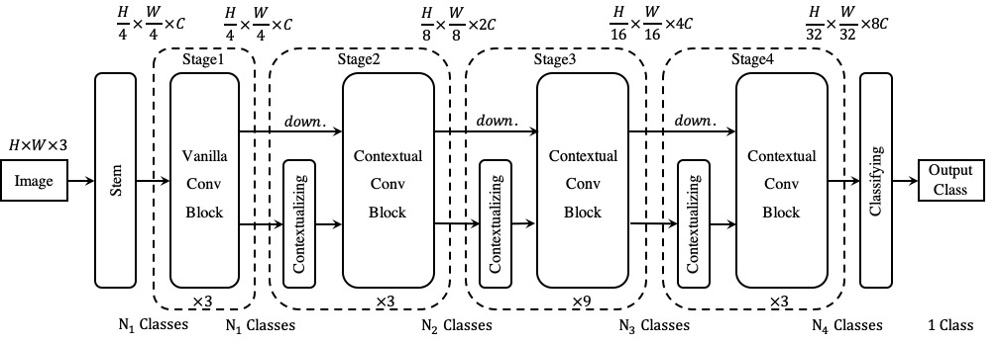

# [ICLR 2023] Contextual Convolutional Networks (Contextual CNNs)

This repo is the official Pytorch implementation of our paper:
> [Contextual Convolutional Networks](https://openreview.net/forum?id=PldynS56bN)    
> Shuxian Liang, Xu Shen, Tongliang Liu, Xian-Sheng Hua    
> ICLR 2023   



## Prerequisites

The code is built with following libraries:

- [PyTorch](https://pytorch.org/) 1.10.0 or higher 
- [Torchvision](https://github.com/pytorch/vision)
- [TensorboardX](https://github.com/lanpa/tensorboardX)
- [fvcore](https://github.com/facebookresearch/fvcore)

## Data Preparation

Our work uses [ImageNet-1K](http://image-net.org/) for training and evaluation. The dataset structure is as follows:

```
/path/to/imagenet-1k
├── train
│   ├── *.JPEG
├── train.txt
├── val
│   ├── *.JPEG
└── val.txt
```

The style of the annotations (recorded in train.txt/val.txt) is like:
```
<image_name> <label_index>
```
for example,
```
ILSVRC2012_val_00000001.JPEG 65
ILSVRC2012_val_00000002.JPEG 970
...
```


## Training and Evaluation
See [scripts/run.sh](./scripts/run.sh) for training and evaluation instructions.

## Acknowledgement
In this project, we use parts of the implementations of the following works:
- [timm](https://github.com/huggingface/pytorch-image-models)
- [CLIP](https://github.com/openai/CLIP)
- [ConvNeXt](https://github.com/facebookresearch/ConvNeXt)

## Citing
If you find our code or paper useful, please consider citing
```
@inproceedings{liang2023contextual,
    title={Contextual Convolutional Networks},
    author={Shuxian Liang and Xu Shen and Tongliang Liu and Xian-Sheng Hua},
    booktitle={International Conference on Learning Representations (ICLR)},
    year={2023}
}
```


